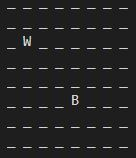

# CodersCamp 2020 - TypeScript

#### Zasady wykonywania zadań praktycznych

Uwaga! Podczas realizacji zadania należy wykonać pracę jedynie w pliku/plikach podanych w treści zadania.
Nie wolno zmieniać (commitować zmian) w plikach w katalogu `src/tests`.
Wprowadzenie zmian w tych plikach, będzie skutkować uzyskaniem 0 punktów za zadanie.
Twój czas wykonywana zadania to czas pomiędzy opublikowaniem na Discord linku do zadania a dokładną datą Twojego ostatniego commita w repozytorium z zadaniem.
Dlatego, kiedy uznasz zadanie za zakończone, już nic nie zmieniaj. Upewnij się także na GitHub, że wykonałeś push.

## ♟️ Zadanie praktyczne — Implementacja ataku królowych

#### ⏰ Czas na wykonanie: 60 minut

W pliku `queensAttack.ts` uzupełnij implementację.
Klasa `QueensAttack` powinna implementować typ `QueensPositions` zawarty w `types/queensPositions.ts`.
Typ `QueensPositions` zawiera atrybut `white` oraz `black` typu `Queen` zawarty w `types/queen.ts`.
Typ `Queen` jest dwu-elementową tablicą `number`.
Stała `SAME_POSITION_ERROR` zwraca komunikat błędu `Queens cannot be in the same position` i zawarty jest w pliku `errors.ts` w katalogu `shared`.

W trakcie wykonywania zadania należy skorzystać z utworzonego typu `QueensPositions` oraz stałej `SAME_POSITION_ERROR`.

### 🚀 Wyzwania stojące przed Tobą

W ostatnio rozpoczętym projekcie, polegającym na stworzeniu symulatora ruchów w szachach, zabrakło rąk do pracy.
Z tego tytułu zostałeś oddelegowany do tego projektu. Koledzy z Twojego zespołu przekazali Ci gotowe typy oraz testy jednostkowe do Twojej implementacji,
których wykorzystanie jest wymagane.

Upewnij się, że w pliku `queensAttack.ts` importujesz typ `QueensPositions` oraz komunikat błędu `SAME_POSITION_ERROR`.
Ich brak, może spowodować, że testy nie przejdą a Twoje zadanie zostanie uznane za niepoprawne.
Klienta interesuje oczywiście zadanie, które przejdzie testy!

Na podstawie pozycji dwóch królowych na szachownicy, musisz zwrócić informację, czy możliwe jest wykonanie przez nich ataku nawzajem.
W szachach, królowa może atakować pionki, które są w tym samym rzędzie, kolumnie lub po przekątnej.
Przyjmujemy, że szachownica jest reprezentowana przez tablicę `8 x 8`.
Oznacza to, że jeżeli przyjmiemy sytuację, że biała królowa (`W`) jest na pozycji `(2, 1)` a czarna królowa (`B`) na `(5, 4)`, to ustawienie będzie wyglądało następująco:

Na podstawie układu, możemy odpowiedzieć na pytanie, czy mogą zaatakować się nawzajem. W tym przypadku, mogą. Dlaczego? Ponieważ obie, stoją po przekątnej do siebie.

Jako, że kamień milowy już blisko, nie zostało Ci dużo czasu na realizację tego zadania.
Zostało Ci 60 minut, a każda minuta opóźnienia będzie kosztować Twój zespół $1!

- Klasa `QueensAttack`
  Utworzenie nowej instancji tej klasy wymaga podanie do niego obiektu o dwóch atrybutach - `white` oraz `black`.
  Atrybuty te reprezentują pozycję białej oraz czarnej królowej na szachownicy (wskazówka w `types/queen.ts` oraz `types/queensPositions.ts`).

  1.  Prawidłowe inicjalizacja królowych **(Wycena: 5$)**

      - Klasa przyjmuje dwa atrybuty (`white` oraz `black`), będące dwuelementową tablicą `number`,
      - konstruktor klasy przyjmuje obiekt typu `QueensPositions`,

  2.  Wyrzucenie wyjątku, gdy królowe znajdują się na tej samej pozycji **(Wycena: 5$)**

      - w przypadku, gdy `white` oraz `black` znajdują się na tej samej pozycji na szachownicy, konstruktor klasy QueensAttack powinien rzucić wyjątek o treści jak w stałej `SAME_POSITION_ERROR`.

  3.  Prawidłowa reprezentacja, królowych na szachownicy **(Wycena: 5$)**

      - W klasie znajduje się publiczna metoda `representBoardAsString` nie przyjmująca żadnych argumentów a zwracająca łańcuch znaków (`string`),
      - wiersze zapełniane są na początku znakiem `_`,

        Przykład:
        `"_ _ _ _ _ _ _ _"`

      - następnie, ustalane jest położenie królowych - znaki reprezentujące królowe to `W` dla białej (`white`) oraz `B` dla czarnej (`black`).

  4.  Zwracanie informacji o tym, czy możliwe jest wykonanie ataku przez królową **(Wycena: Patrz niżej)**
      - W klasie znajduje się publiczna metoda `queenCanAttack`, która zwraca `true` lub `false` (`boolean`),
      - w przypadku, gdy królowe nie stoją w tym samym rzędzie, kolumnie ani po przekątnej do siebie, metoda zwróci `false` **(Wycena: 5$)**,
      - w przypadku, gdy królowe stoją w tym samym rzędzie, metoda zwróci `true` **(Wycena: 5$)**,
      - w przypadku, gdy królowe stoją w tej samej kolumnie, metoda zwróci `true` **(Wycena: 5$)**,
      - w przypadku, gdy królowe stoją po przekątnej do siebie, metoda zwróci `true` **(Wycena: 5$)**.

**Całość**: 35$ + opóźnienie (-1$ \* każda rozpoczęta minuta po czasie)

Powodzenia, twój zespół liczy na Ciebie!
